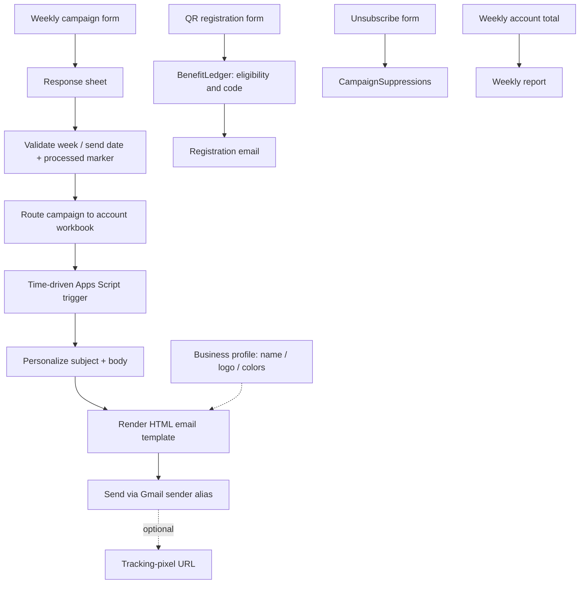

# MailWiz — Campaign Automation on Google Workspace

MailWiz is an email-automation project I built with Google Forms,
Sheets, Apps Script, and Gmail. It covers campaign intake and dispatch,
registration follow-up, reporting, and unsubscribe handling.

## What it does

- I collect each week's campaign brief through a Google Form.
- I validate the requested send date/week in Sheets and route the campaign to
  the right account workbook, with a processed marker to avoid duplicates.
- A time-driven trigger sends personalized HTML emails (per-client subject and
  body, sender alias).
- I send a QR sign-up confirmation and a weekly account report.
- The project includes an Apps Script registration-email template, code
  generator, renderer, and sender helper.
- Cashiers can validate and redeem an issued code from a bound-sheet dialog.
- QR responses use a separate benefit ledger; campaign opt-outs use a separate
  suppression list.
- It also includes a personalized campaign-email template and a one-recipient
  sender helper with an optional tracking-pixel URL slot.
- I added a business-profile dialog to configure business name, logo, colors,
  sender alias, and campaign links.
- I handle unsubscriptions from a form submission.

## Skills demonstrated

- Google Apps Script (triggers, `SpreadsheetApp`, `FormApp`, `GmailApp`).
- Google Forms + Sheets as an intake, validation, and routing layer.
- HTML email templating and mail merge with per-recipient personalization.
- Time-driven and form-submit automation.
- Idempotent, retry-safe flows (response fingerprints, ledger states, suppression checks).
- Per-business branding and email-flow configuration.
- Designing a repeatable process around tools non-technical staff already know.

## Workflow

I explain the workflow in more detail in [`docs/workflow.md`](docs/workflow.md),
with implementation notes in [`docs/benefit-ledger-flow.md`](docs/benefit-ledger-flow.md)
and [`docs/campaign-email-flow.md`](docs/campaign-email-flow.md).

I left a responsive HTML/CSS preview of the two registration-email states at
[`prototypes/registration-email-preview.html`](prototypes/registration-email-preview.html),
and the Apps Script templates and helpers under [`apps-script/`](apps-script/).

## Interesting design choices

- I used a form for the campaign brief instead of a shared spreadsheet cell, so
  account managers submit structured data and the workflow can validate it.
- A date/week formula plus a "processed" flag stops the same brief from being
  sent twice.
- I split the email template into subject, body, conditions, and footer, so the
  same layout is reused across clients with a sender alias per account.

## Project scope

- Campaign opt-outs are stored separately from benefit history and retain the
  unsubscribe response.
- Campaign tracking is optional and requires a complete URL from a configured
  service.
- I make no claims about delivery rates, open rates, time savings, or business
  impact.
- I excluded all customer data, account identifiers, endpoint URLs, and brand
  assets.

## Repository contents

- `docs/workflow.md` — reconstructed architecture, evidence status, and notes.
- `docs/registration-email-prototype.md` — Apps Script template fields and registration flow.
- `docs/campaign-email-flow.md` — campaign template fields and dispatch proposal.
- `docs/business-onboarding.md` — business profile fields and onboarding flow.
- `docs/benefit-ledger-flow.md` — QR form mapping, eligibility, retries, and redemption.
- `prototypes/registration-email-preview.html` — responsive static visual prototype.
- `apps-script/` — business onboarding, QR/cashier handling, registration and campaign templates, shared utilities, and send helpers.

## License

All rights reserved. No license is granted: I'm sharing this material for viewing
only, and it may not be copied, reused, or redistributed without my written
permission. I intentionally excluded third-party assets (such as client campaign
images or brand materials).
